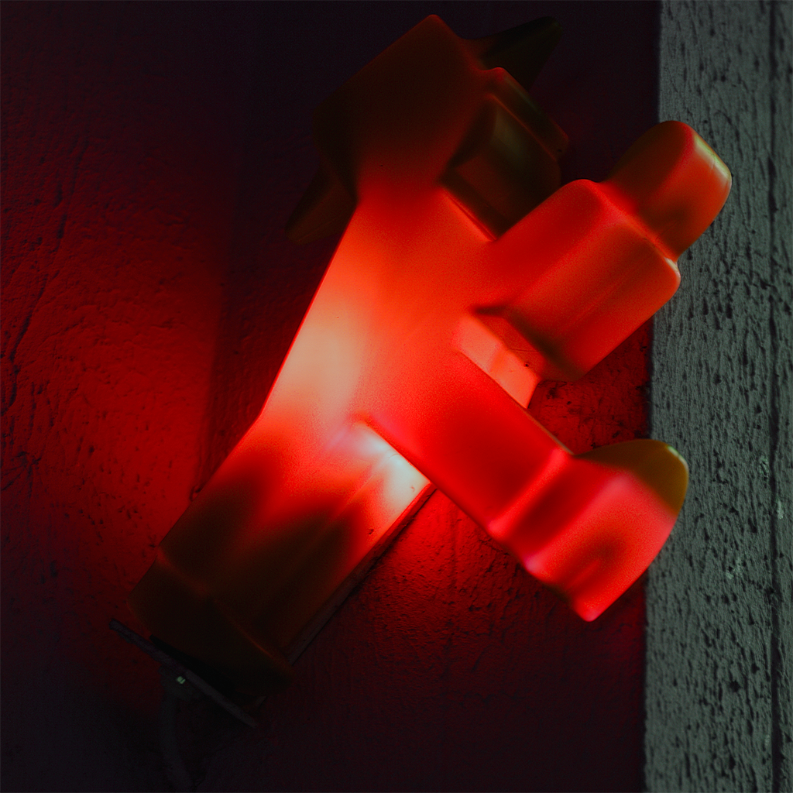
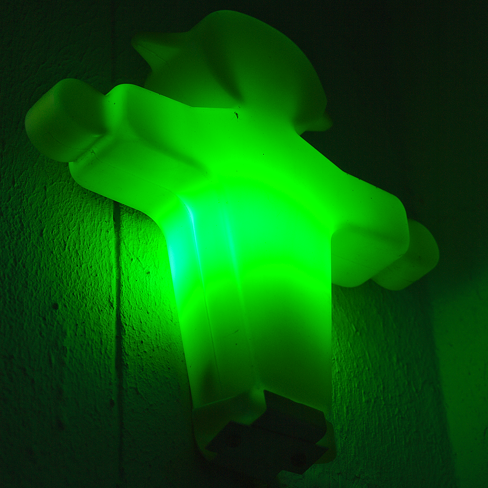

Manchmal braucht es etwas länger, bis eine Idee so rund ist, dass sie 
das Licht der Öffentlichkeit verträgt. Die beiden Ampelmännchen 
schlummerten bereits seit meinem letzten Besuch in Berlin hier auf 
dem Mac. Ihnen fehlte noch der passende Rahmen, eine innigere 
Verbindung als nur ihre Form. Vermutlich hätte ich sie irgendwann auch 
einmal so gezeigt. Dann sicher kommentarlos, denn sie sprechen 
eigentlich für sich (c;

Vor ein paar Tagen bin ich aber auf der Suche nach Musik zum Arbeiten 
zufällig über eine alte Scheibe aus den 80ern gestolpert, randvoll 
gestopft mit damaligen Hits der Neuen Deutschen Welle. Das war ein 
Stück meiner Jugend und so lief die Platte an dem Abend hoch und 
runter. Dabei war auch ein Titel einer Band namens "Der Plan", an 
dessen Hitpotential ich mich gar nicht recht erinnern konnte. Die 
folgenden Zeilen passten jedenfalls perfekt zu meinen beiden Fotos:

> "Ich will nicht gern bei Rot steh'n, ich will nicht nur bei Grün geh'n ... Warum nicht bei Rot geh'n, warum nicht bei Grün steh'n?"

Warum nicht ... (c; ?
