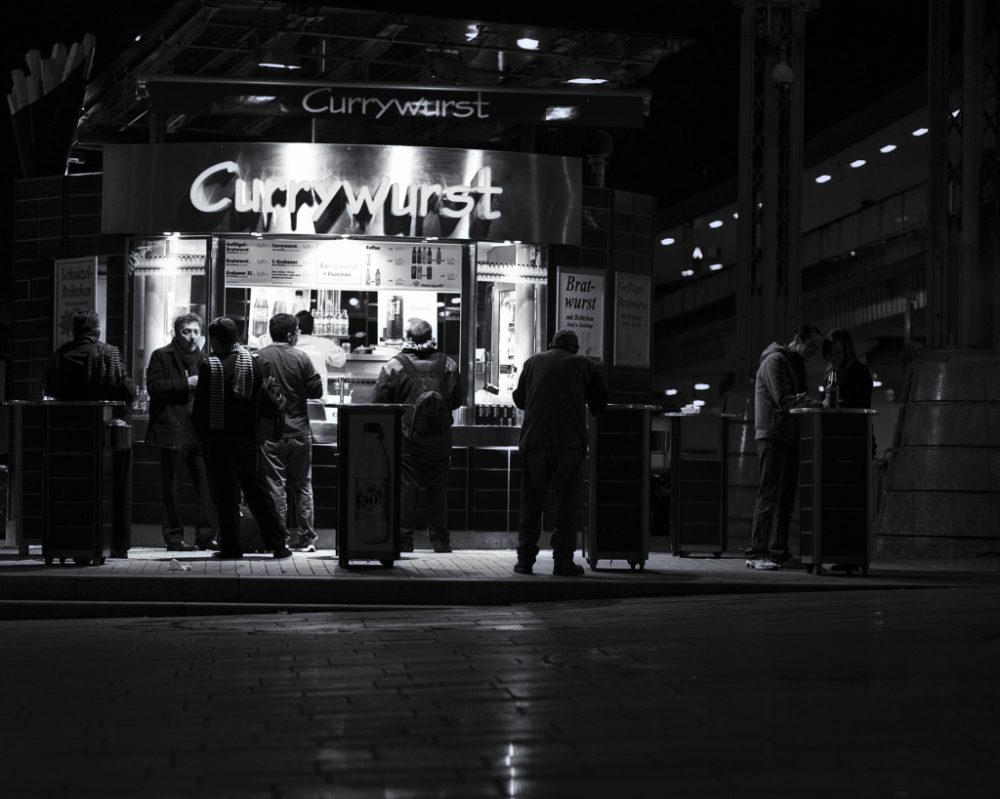

Es gab sie schon, als die grell erleuchteten Tresen der Mc's und King's 
noch keine Zuflucht mitten in der Nacht boten. Manche wurden sogar durch's 
Fernsehen berühmt. Diese hier wurde auch noch um zwei Uhr morgens von 
nimmermüden Nachtgestalten, gestrandeten Reisenden und Pärchen, die die 
Frage "Zu mir oder zu Dir?" noch nicht endgültig geklärt hatten, belagert. 
Ich hatte gerade eine Stunde zuvor auf die beste Currywurst Düsseldorfs 
verzichtet, da mich die lange Menschenschlange vermutlich den letzten Zug 
nach Hause gekostet hätte. Hätte ich hier als Alternative womöglich die 
beste Currywurst Kölns bekommen? Es fehlte die Schlange und vor allem 
fehlten die Taxifahrer, die ein sicheres Indiz für Qualität sind. Also 
keine Wurst ... aber wenigstens ein Foto!

