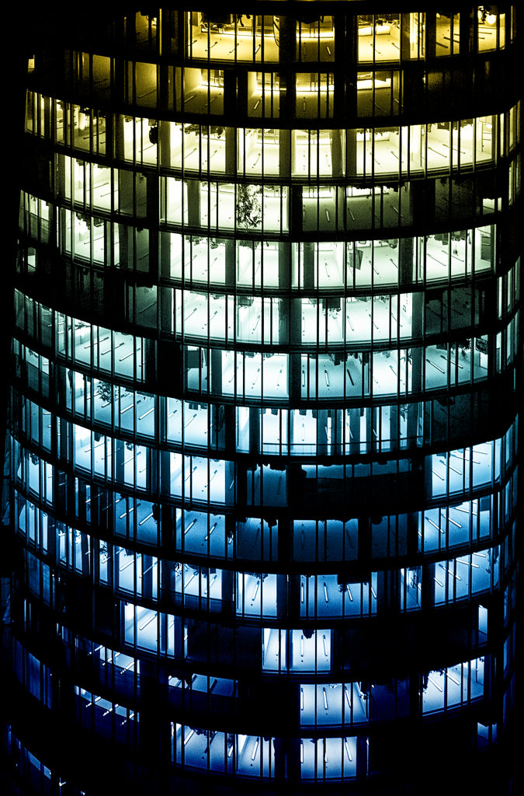

Da ich gerade schon mal beim Aufräumen bin, gibt's gleich noch eins 
hinterher. Ich habe mir schon vor längerer Zeit angewöhnt, manchmal 
eine Station vor dem Ziel auszusteigen, um auch ohne Fitnessstudio in 
Bewegung zu bleiben. Der Weg von der Deutzer Messe über den Rhein 
hinüber zum Dom ist zwar oft recht windig, dafür gibt es dort stets 
eine Menge Touristen zu sehen, die die zahllosen Liebesschlösser auf 
der Hohenzollernbrücke bestaunen. Und wenn man sich auf der Brücke 
mal umdreht, kann man den LVR-Turm in voller Schönheit sehen, an dem 
man gerade achtlos vorbeigerannt ist. An diesem Abend war nicht nur 
hoch oben die Plattform stimmungsvoll beleuchtet, sondern auch in den 
Büros brannte noch überall Licht, obwohl doch längst schon Feierabend 
war.

