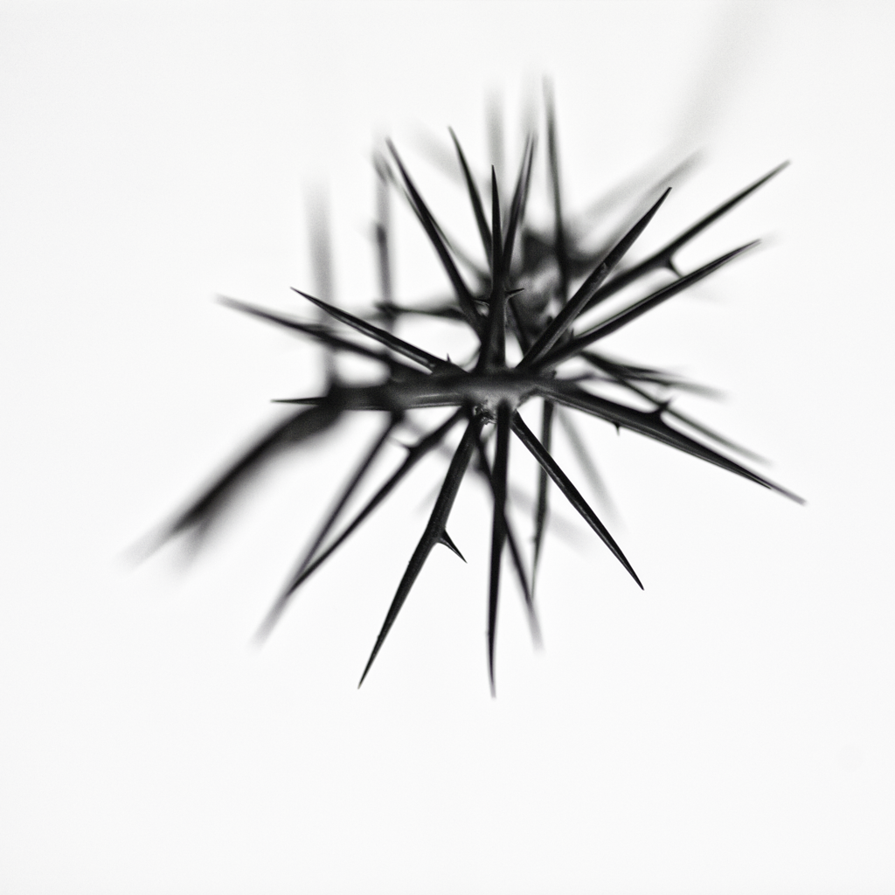

Das Motiv für dieses stachelige Foto verdanke ich der letzten Ausstellung 
&raquo;morbit orbit&laquo; von Michael Schulz in der Galerie DISPLAY. Er 
hatte sehr humorvolle Ideen in Collagen und Objekte gebannt, hintergründig, 
oft um die Ecke gedacht. Die Ausstellung ist inzwischen Geschichte, das 
Foto geblieben.

