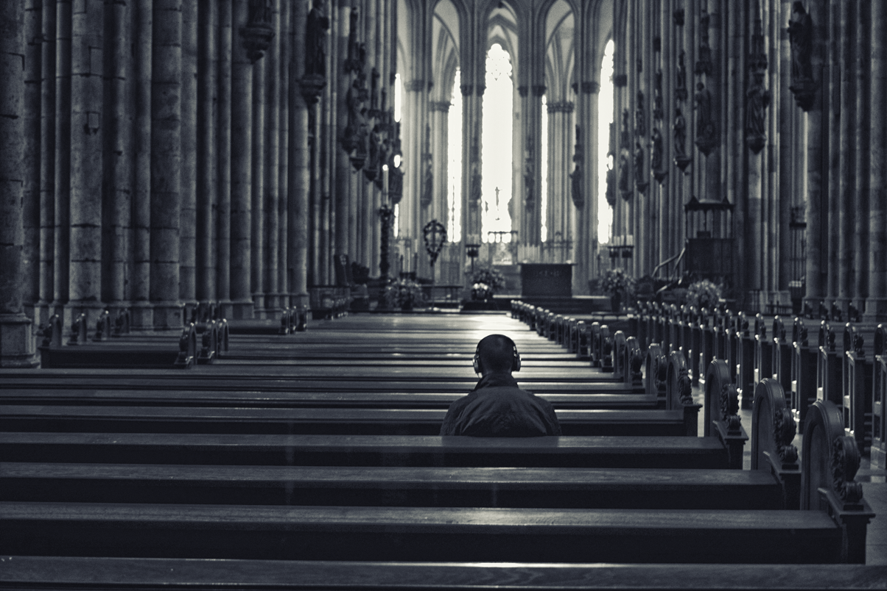
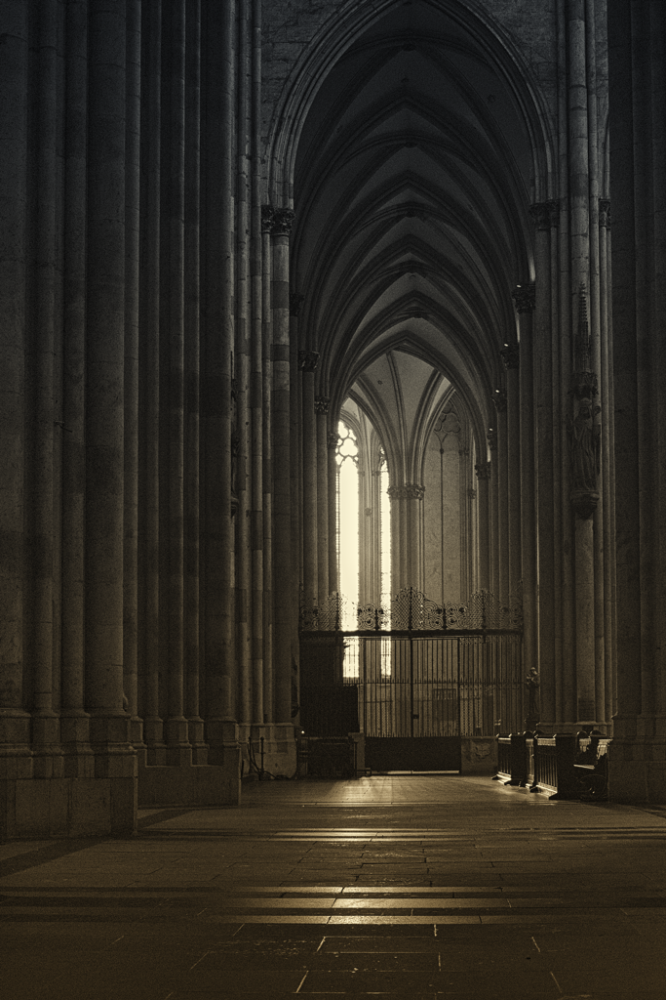
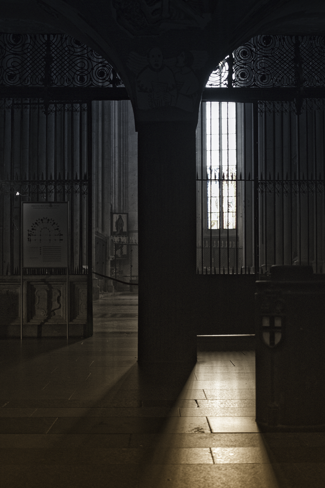

Eigentlich sind die Tage um Ostern herum etwas ruhiger, die kurzen Wochen 
locken zum Verreisen. Ich bin hier geblieben, wollte die Ruhe genießen. 
Doch das war gar nicht so einfach, denn Köln fühlte sich noch viel voller 
als alltags an. Die stillen Momente habe ich dann ganz unerwartet mitten 
in der Stadt gefunden, morgens kurz nach sieben im Dom. Draußen ging 
gerade die Sonne auf, die hohen Fenster begannen zu leuchten. Drinnen zog 
eine Putzfrau leise wischend ihre Bahnen, die Domschweizer in ihren roten 
Talaren drehten bedächtig ihre ersten Runden. In der Luft hing noch der 
Dunst der abendlichen Messe. Und sonst war es einfach ... still.

