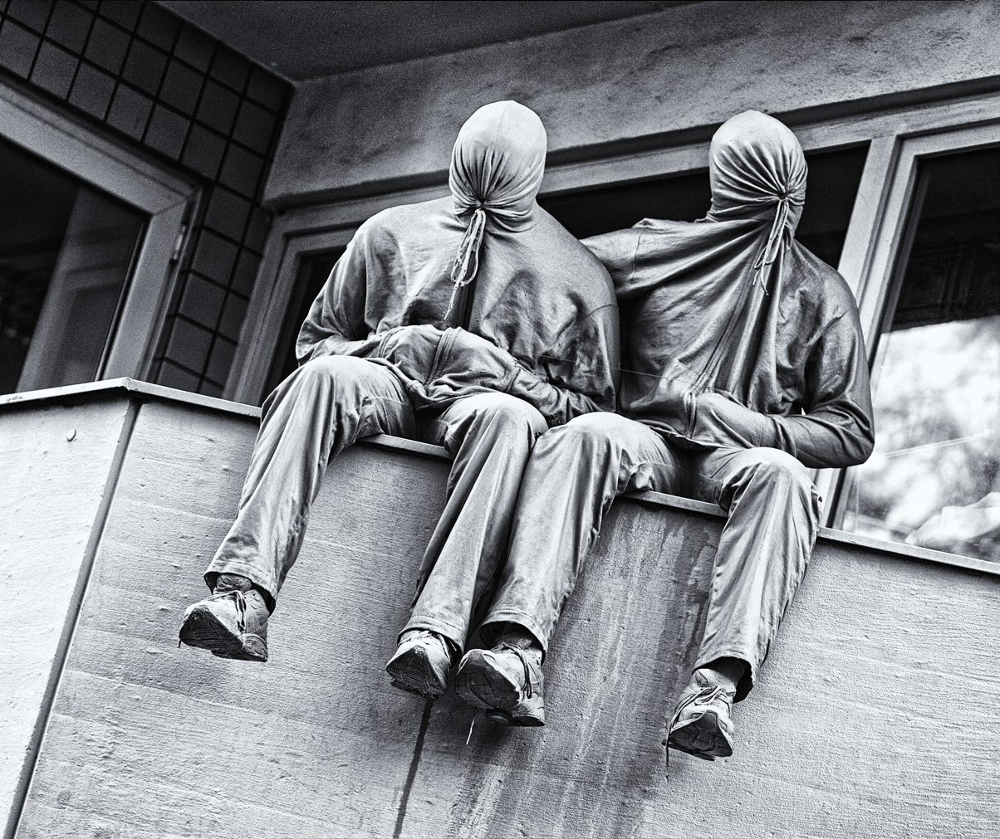
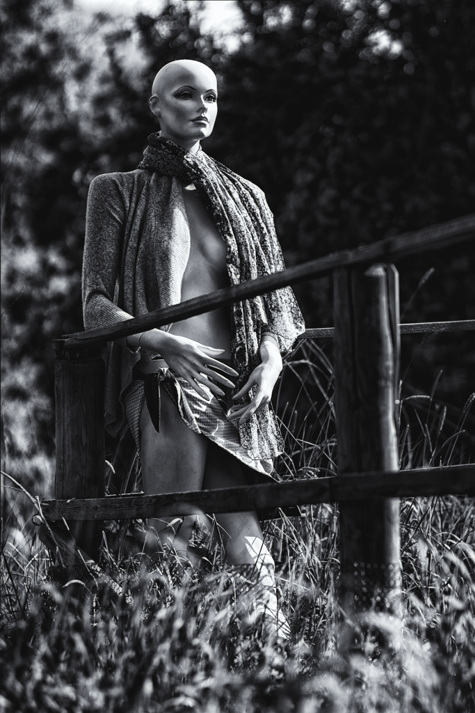

Also ganz unter uns, wer schaut heute unterwegs noch nach links und 
rechts? Die meisten haben doch die Nase auf irgendwelche Bildschirme 
gesenkt, selbst auf Bahnhofstreppen oder auf dem Weg durch die Stadt 
von A nach B. Man könnte ja was verpassen. Und tatsächlich, 
man verpasst was ... nämlich die merkwürdigen Gestalten, die da 
unbeweglich in der Gegend rumstehen, bei Sonne und Regen, Wind und 
Wetter. Manchmal, wie am Brüsseler Platz in Köln, sind sie bis oben 
hin zugeknöpft und man muss den Kopf schon deutlich von was auch 
immer heben, um sie überhaupt auf ihrem Balkon zu entdecken. Draußen 
vor der Stadt geben sie sich dann freizügiger, das Dekolleté bis zum 
Bauchnabel reichend, um mit spitzen Fingern neugierige Spaziergänger 
auf einen näheren Blick zu sich auf die Wiese und an den Gartenzaun 
zu locken. Sprachlos allesamt, aber braucht es noch Worte, wenn man 
so ausschaut?

