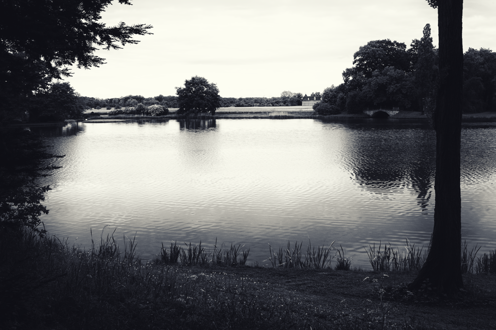

Es war still hier seit Anfang Mai, seit jenem Anruf, dass er nicht mehr 
da ist. Nun lag vor einigen Wochen ein Brief im Kasten, von einer 
Freundin, die sonst nie Briefe schreibt. Schlicht, weißer Umschlag, 
nichts Besonderes. Wir sind ungefähr gleich alt. Manchmal dreht sich 
eins unserer Gespräche auch um die Eltern, deren Altern, was sich ändert, 
schon nicht mehr geht. Ich habe den Brief vorsichtig in die Wohnung 
getragen, mich zum Lesen hingesetzt.

Der Brief entpuppte sich als ganz harmlos, eine Einladung zu einer 
Ausstellung, um ein Stück Leben feiernd abzuschließen. Ein lange 
zurückliegendes Jahrzehnt Lebensgeschichte muss einer stetig wachsenden 
Straße weichen.

Meine Fahrt in die alte Heimat an einem kühlen Maitag war dagegen ein 
endgültiger Abschied, ein Stück meines Lebens wird nie mehr so wie früher 
sein. Einer weniger, der am Hoftor warten wird. Ein früher Aufbruch ... 
zu früh ... hinter der Elbe zog mich der Blinker rechts raus, rein in 
die morgendliche Ruhe des Wörlitzer Parks. Keine Fragen, keine Blicke, 
noch keine Menschen. Die Bilder von diesem Morgen werden für mich 
besondere bleiben.

