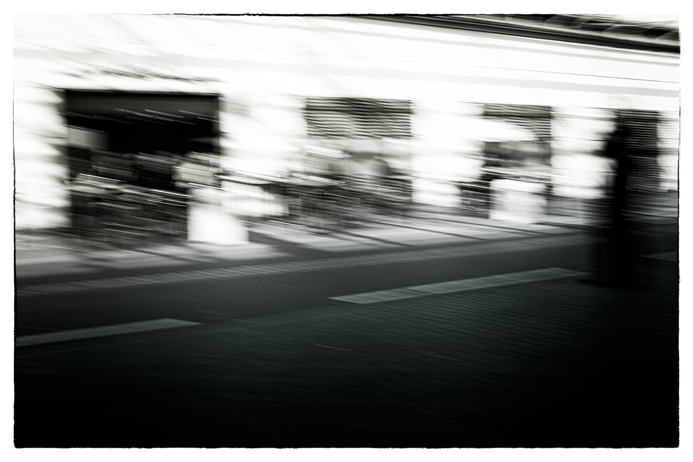
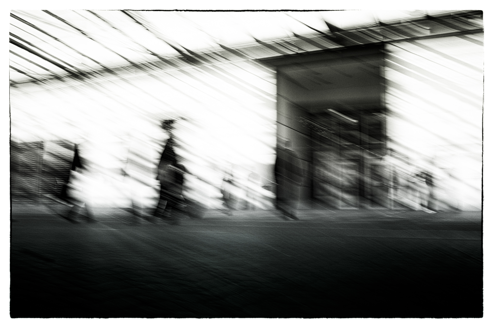
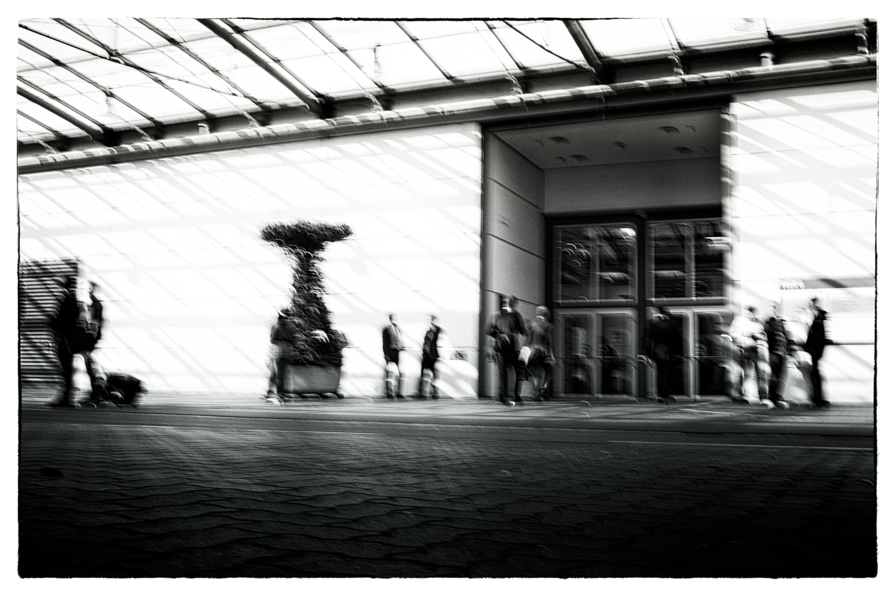

Messeimpressionen der anderen Art. Ich war nach 20 Jahren zum ersten Mal wieder auf der CeBIT in Hannover. Nicht zum Gucken, sondern um ein Projekt vorzustellen. Damit verbunden waren fünf kunterbunte Tage, Blicke hinter Kulissen und Pausen am Rande, mit verwundertem Blick auf das hektische Treiben.

