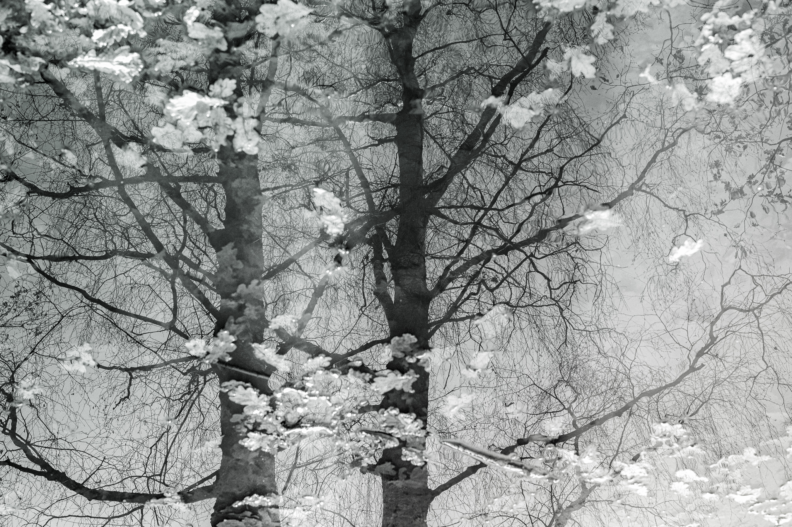
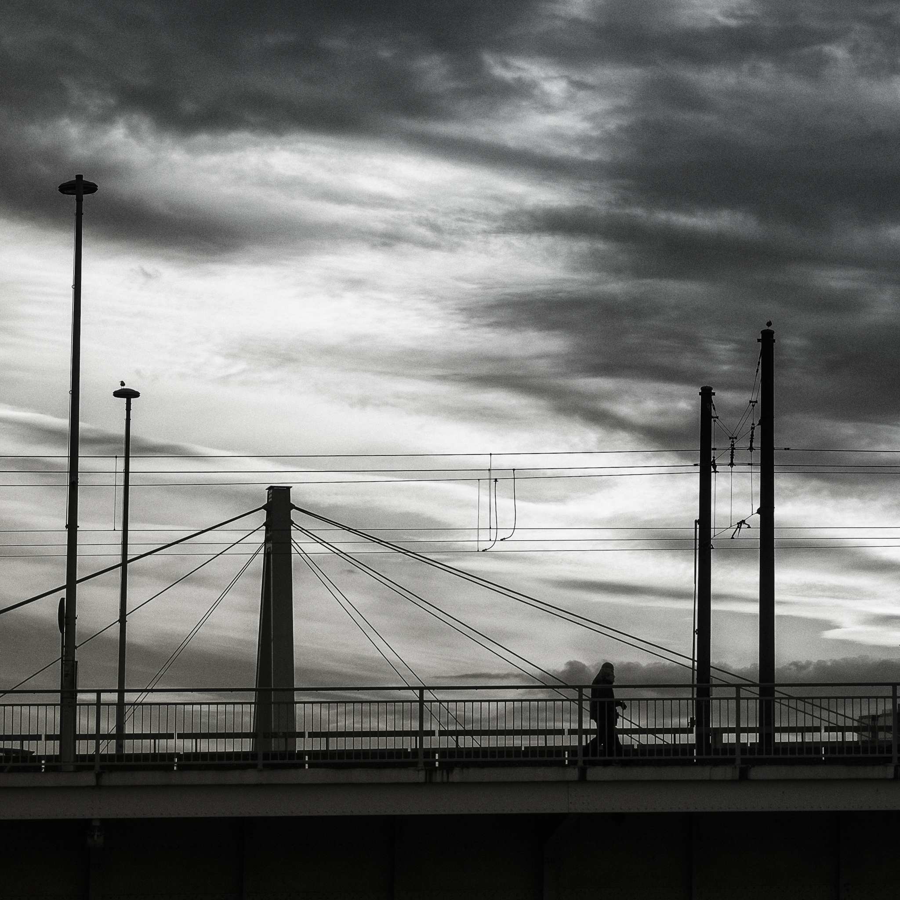

Ein kalter Nachmittag, irgendwann zwischen ausgefallenem Winter und dem 
Gefühl des nahenden Frühlings. Die Neugierde auf die Reste des Hochwassers 
auf den Rheinwiesen hatte mich vor die Tür gezogen, die Enttäuschung 
über ein paar modrige Tümpel weiter über die Brücken in die Stadt getrieben. 
Die Leute eilten mit zwischen die Schultern gezogenem Kopf vor dem Wind 
dahin, die am Himmel vorbeifliegenden Wolken wohl als Vorbild. 
Erstaunlicherweise fanden sich in der Kamera nur ruhige Bilder, wohl dem 
hastigen Treiben zum Trotz.

