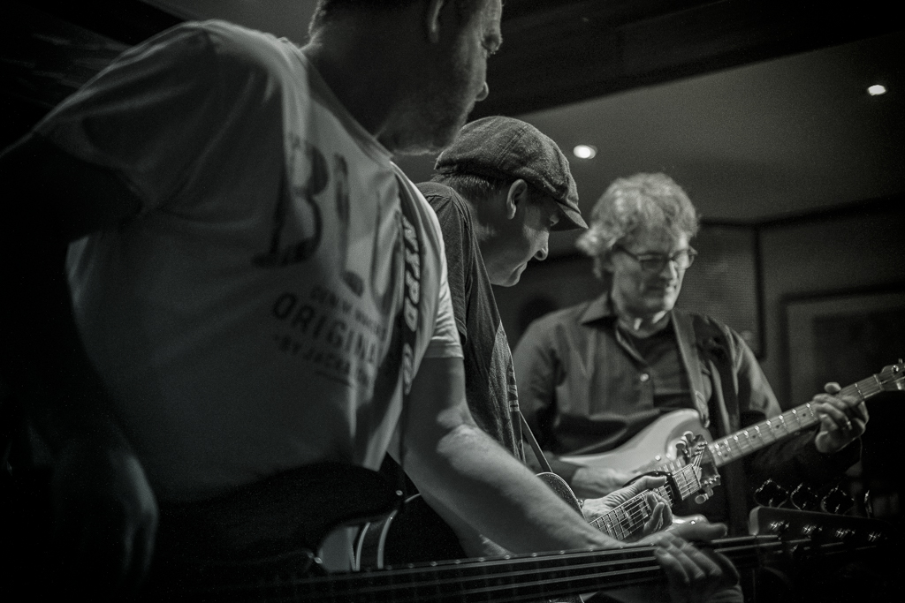
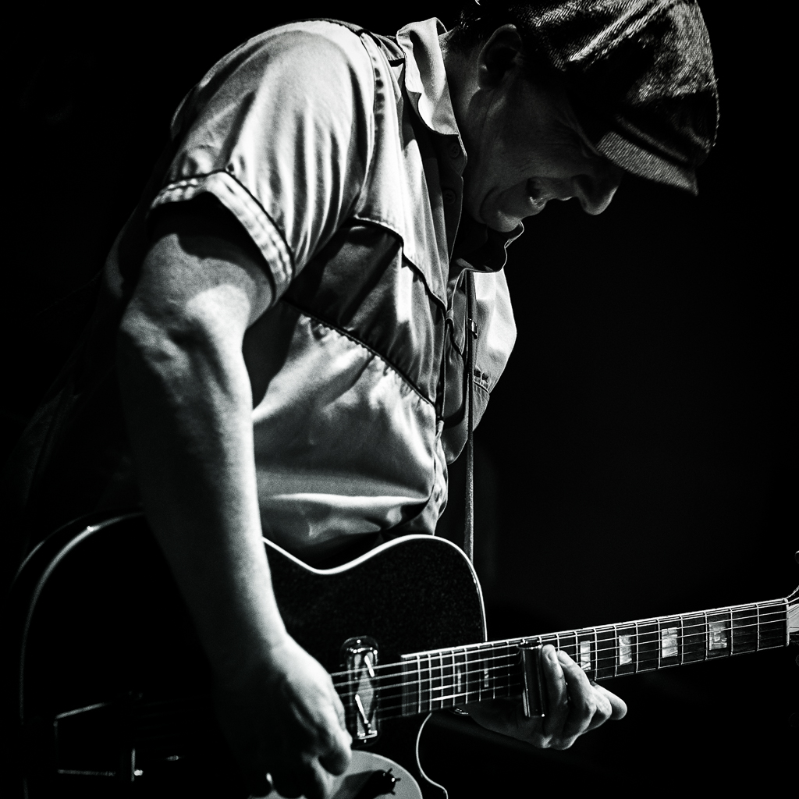
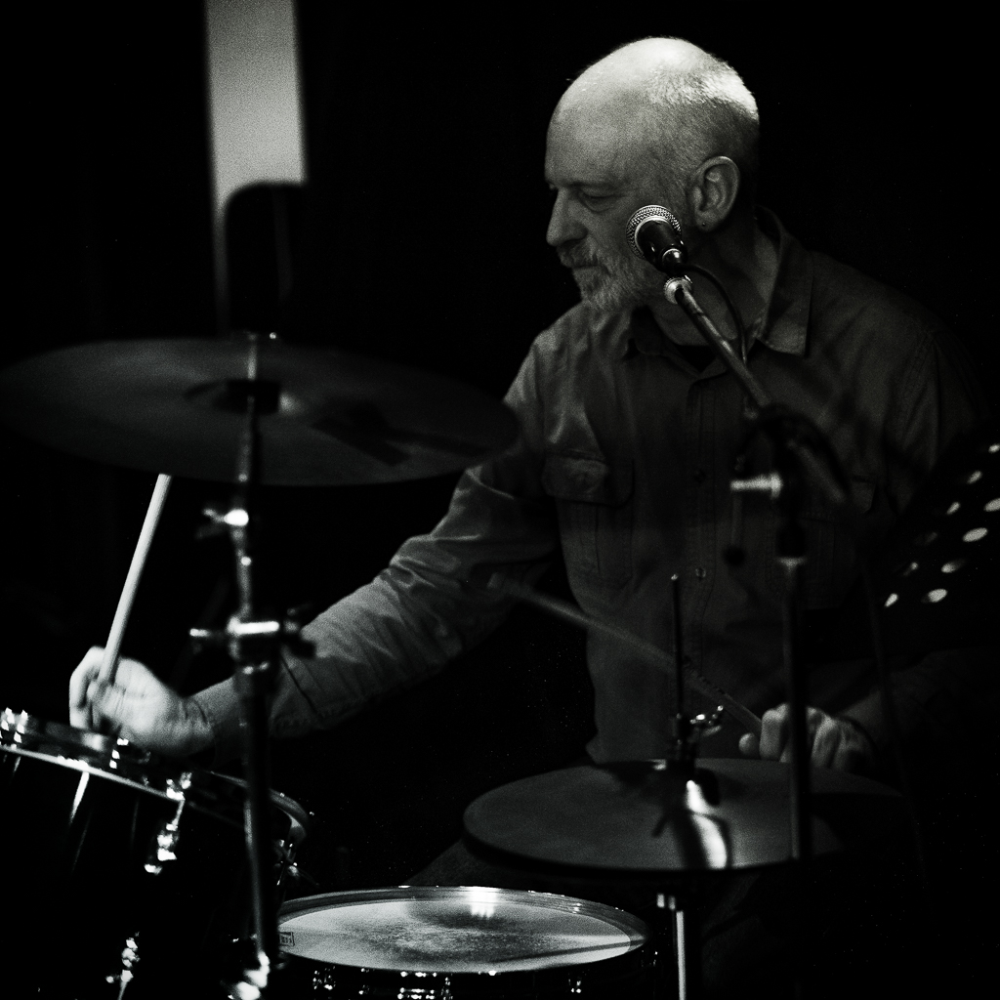
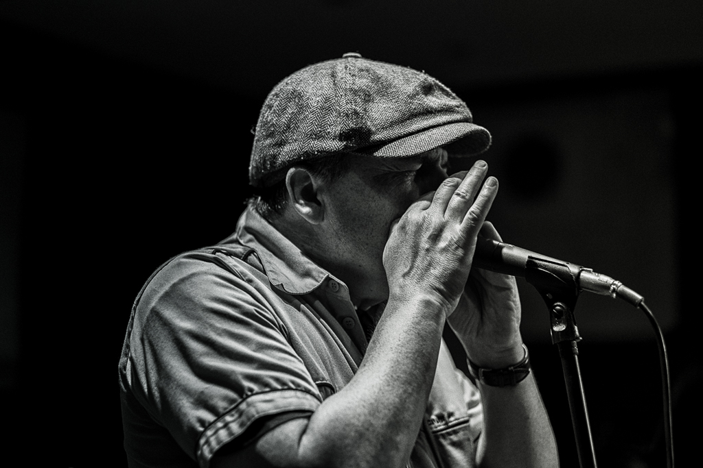
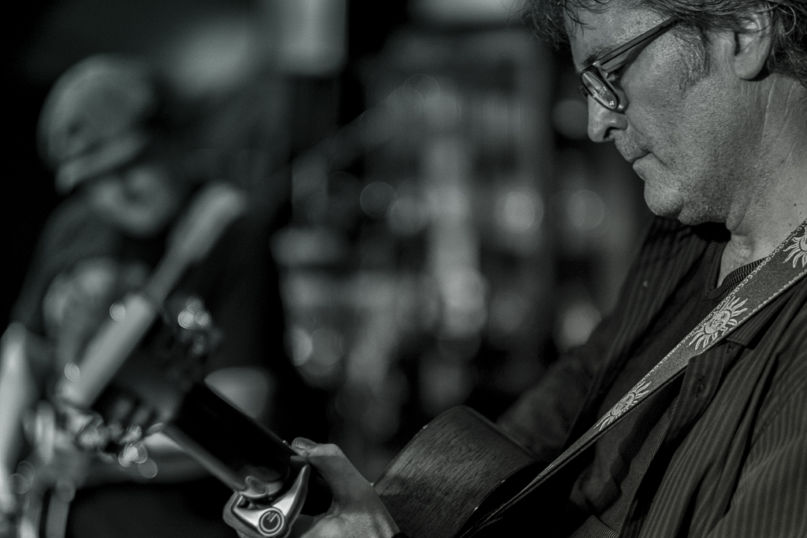
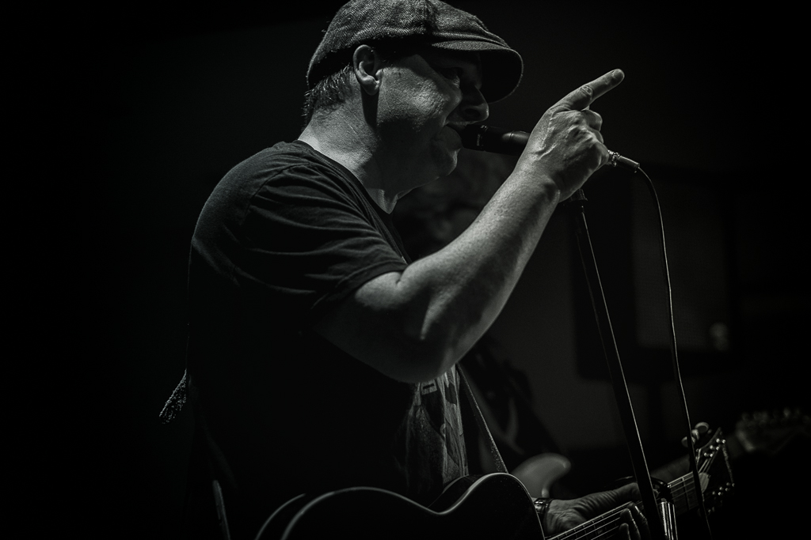

Endlich mal wieder ein Konzert, Musik live und vor allem nah, ganz nah! Zu verdanken hatte ich dies am vergangenen Wochenende Guido Lehmann, der mit seiner neuen Band *The Breezers* ein beschauliches kleines Sportlokal am Rande Kölns in Schwung brachte. Draußen Regen in Bindfäden und erste Anzeichen eines mürrischen Sturms, der lustlos mit der vergilbten Markise spielte, drinnen vertraute, neu aufgemischte Coverversionen von J.J. Cale und Clapton. Auf der improvisierten Bühne bekannte Gesichter aus vergangenen Bands wie der *Ragged Company* und aktuellen musikalischen Projekten wie *12 Bars Down* oder *Hillbilly Deluxe*.

Ich habe an diesem verregneten Wochenende wieder einmal gemerkt, wie vertraut mir diese bunte musikalische Truppe geworden ist ... egal, ob sie nun gerade Country oder Blues spielen. Auf den Knien vor der Bühne, wenn ein Lächeln über ein konzentriertes Gesicht huscht, das den Finger dazu verleitet, genau jetzt den Auslöser durchzudrücken. Aber auch am Tag danach, wenn ich mich durch die fotografische Ausbeute grabe, um die Perlen herauszufischen, dabei abschweife und eben mal kurz ins Archiv abtauche. Der Blick auf die Jahreszahlen der Ordner lässt mich manchmal staunen ... so lange ist das schon wieder her? Für heute bleiben aber erst einmal ein paar neue Fotos, die ersten seit langem ...

