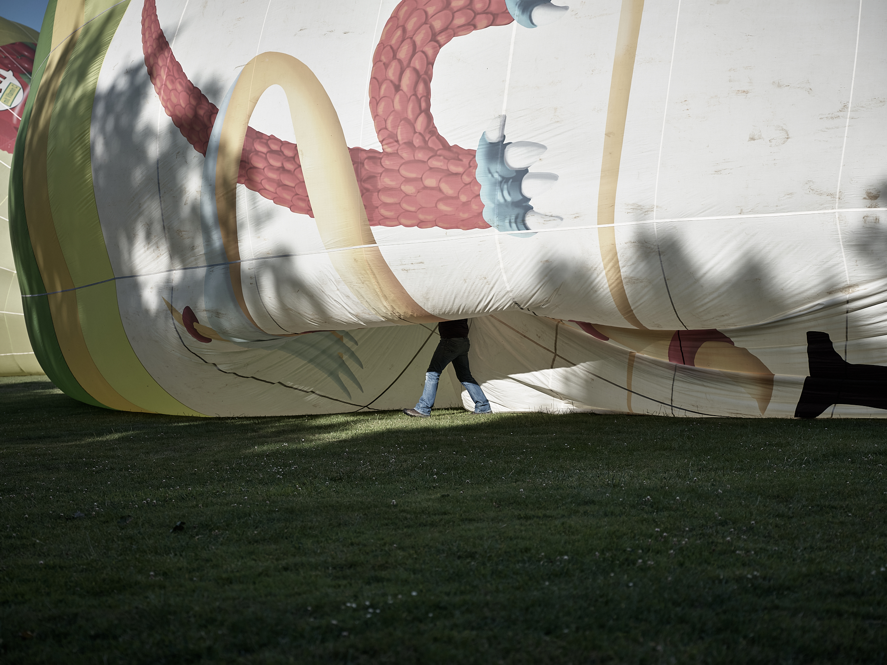
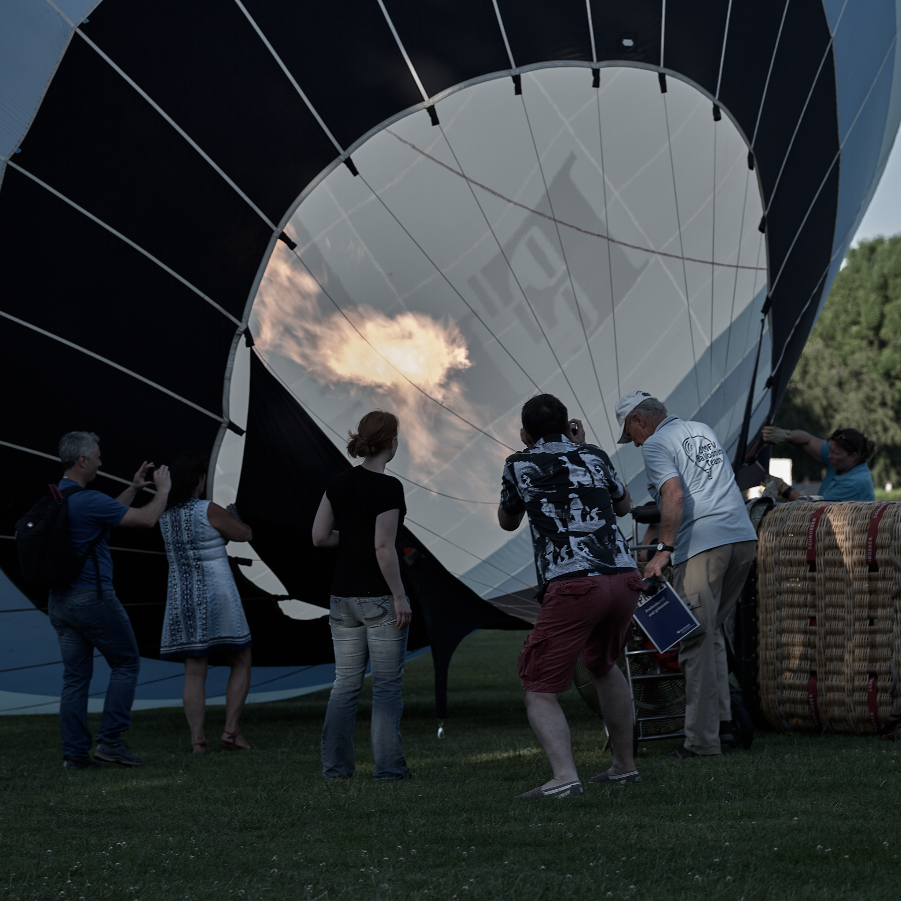
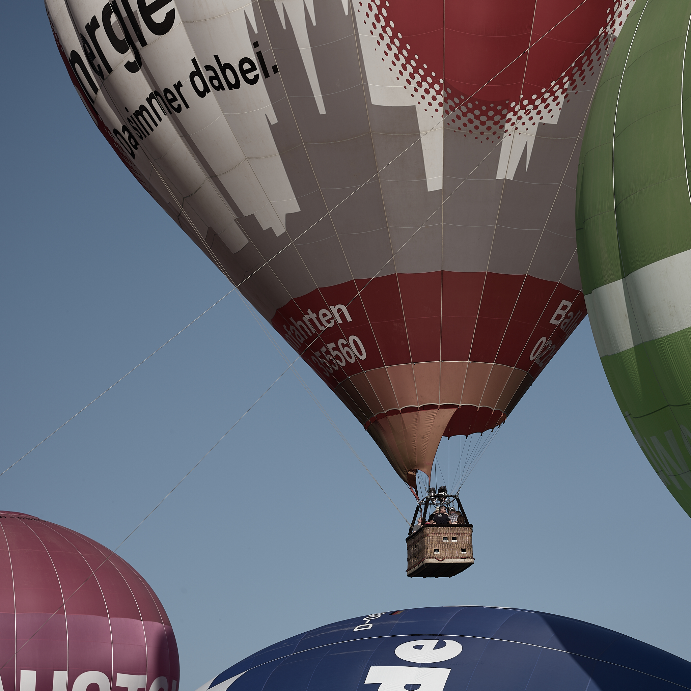
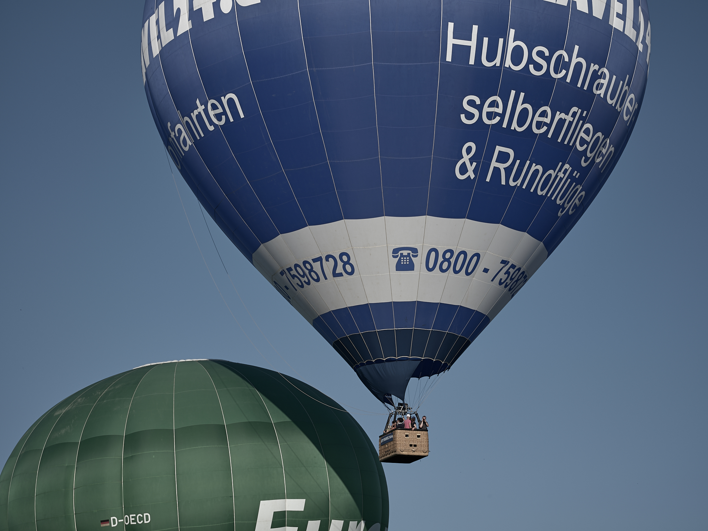
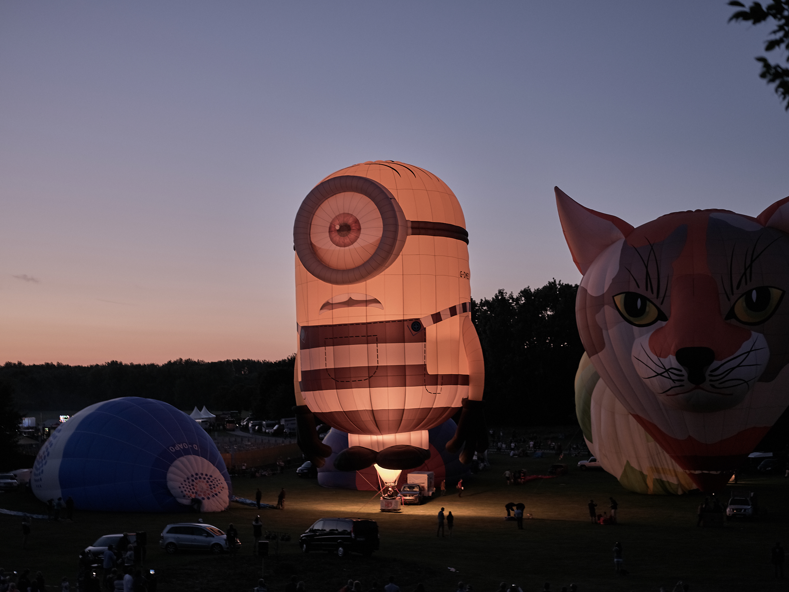
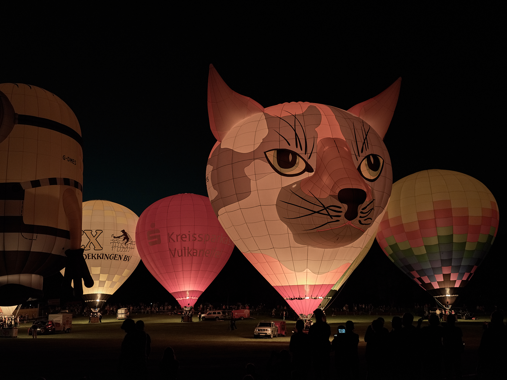
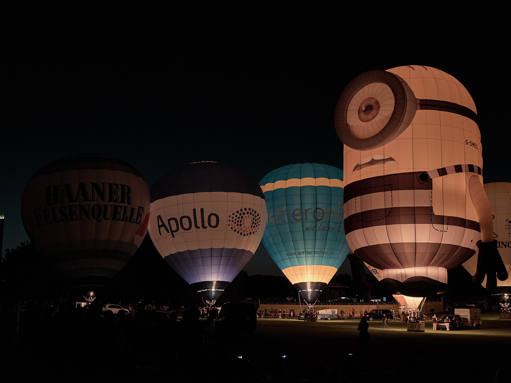

Ein Ballon über der Bonner Rheinaue ist keine Seltenheit, liegt hier doch einer der Startplätze für Fahrten über das nahe Siebengebirge oder die Eifel. Wenn die majestätischen Gebilde sich aber in Gruppen in den Abendhimmel erheben, dann ist es wieder Zeit für das alljährliche Ballonfestival. In diesem Jahr zeigte sich das Wetter von seiner besten Seite, strahlend blauer Himmel und hochsommerliche Temperaturen lockten viel Publikum an den Rand der großen Startwiese.

Als die Ballone von ihrer Fahrt zurückgekehrt waren, gab es nach Einbruch der Dunkelheit noch ein besonderes Schauspiel ... Ballonglühen begleitet von Musik. Ich hatte mit der Kamera einen hervorragenden Platz am Hang erwischt und konnte das Lichterspiel von dort entspannt verfolgen.

