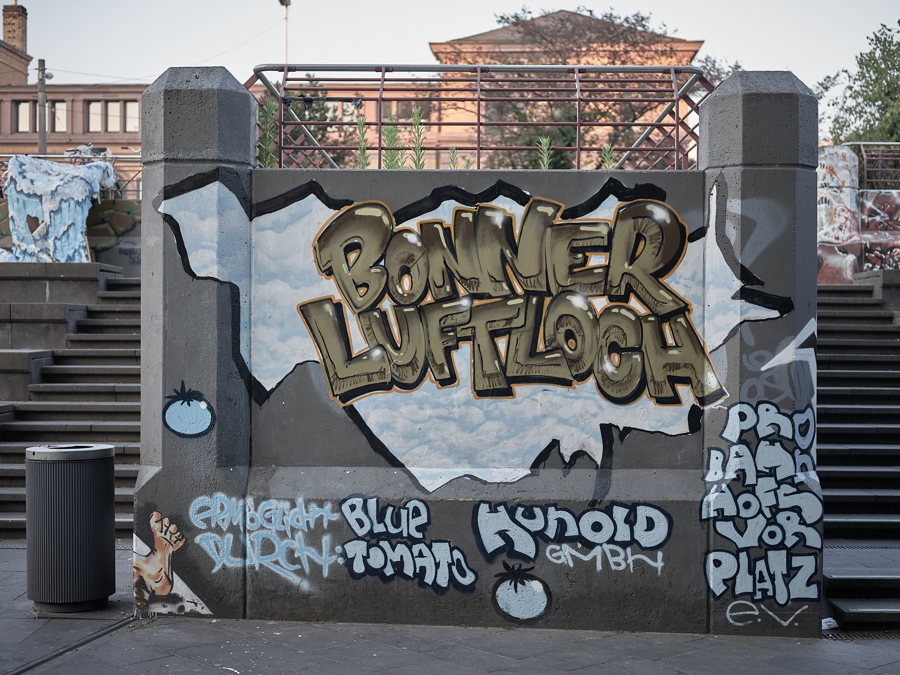
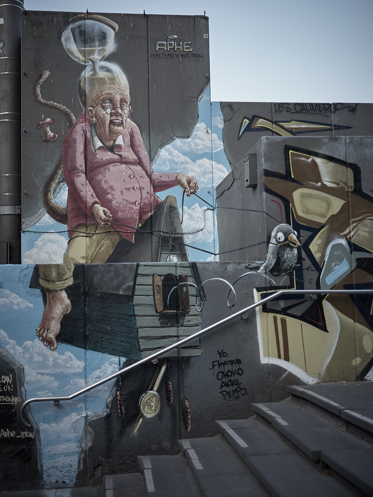
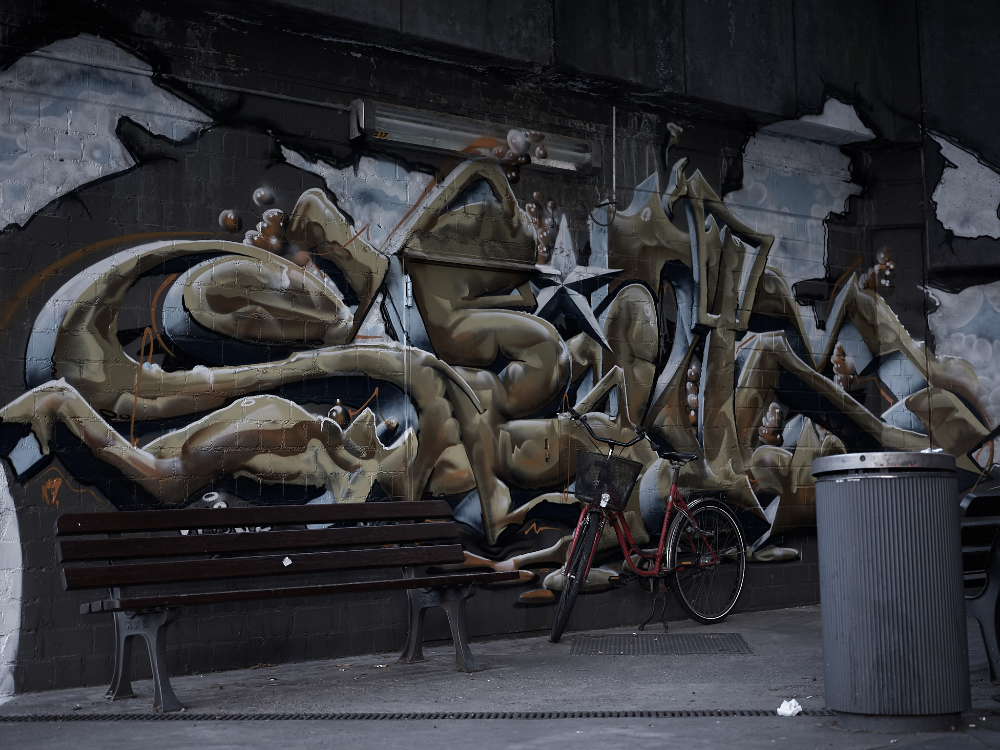

Das Bonner Loch ist keine Sehenswürdigkeit, eher seit Jahrzehnten 
berühmt-berüchtigt durch seine Häßlichkeit. Obdachlose und Junkies 
bevölkern die Treppen, die Reisende aus dem Bahnhof heraus in die 
Innenstadt führen sollen. Es wird gebettelt und gedealt, dabei geht 
es laut und aufdringlich zu.

Inzwischen wurde die Umgestaltung des gesamten Bahnhofsvorplatzes 
beschlossen. Ein erster Gebäudekomplex ist abgerissen, mein am Rande 
der zukünftigen Baustelle gelegener Lieblingsplattenladen hat aufgegeben 
und geschlossen. Auch das Bonner Loch wird nur noch Geschichte sein, 
wenn die zukünftige Bebauung des Areals unter dem mystischen Namen 
Urban Soul abgeschlossen ist.

Für die verbleibende Zeit hat eine Künstlergruppe das Bonner Loch mit 
phantasievoller Graffiti in das Bonner Luftloch verwandelt. Wolken 
und blauer Himmel auf dem tristen Beton, neben dem Eingang in den 
Untergrund läuft die Zeit des Gemäuers symbolisch ab und in einer 
abgelegenen Ecke lauern die Arme eines mysteriösen Großstadtkraken auf 
ahnungslose Passanten. Die Aktion weckt Aufmerksamkeit, hält zum kurzen 
Verweilen an ... den Ort in seiner jetzigen Form kann sie nicht mehr 
retten.

