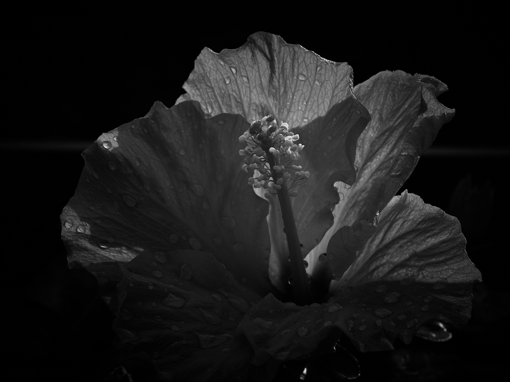
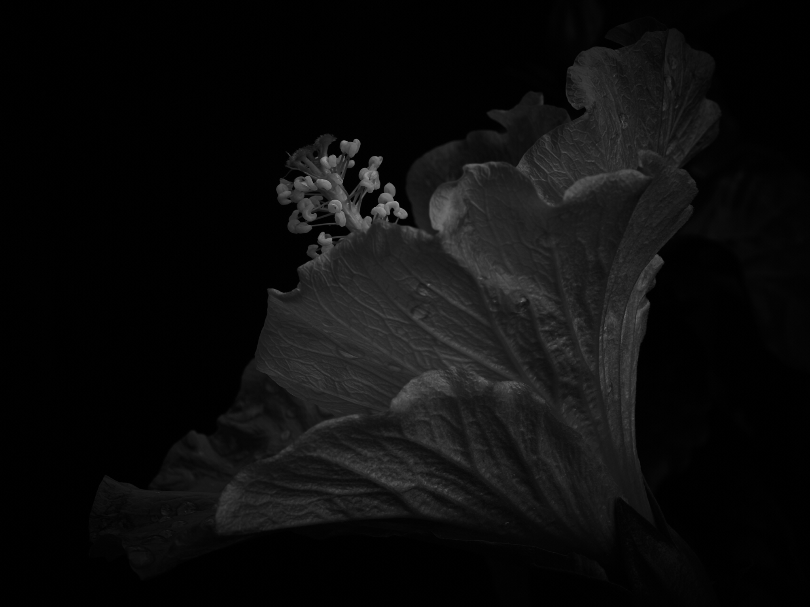
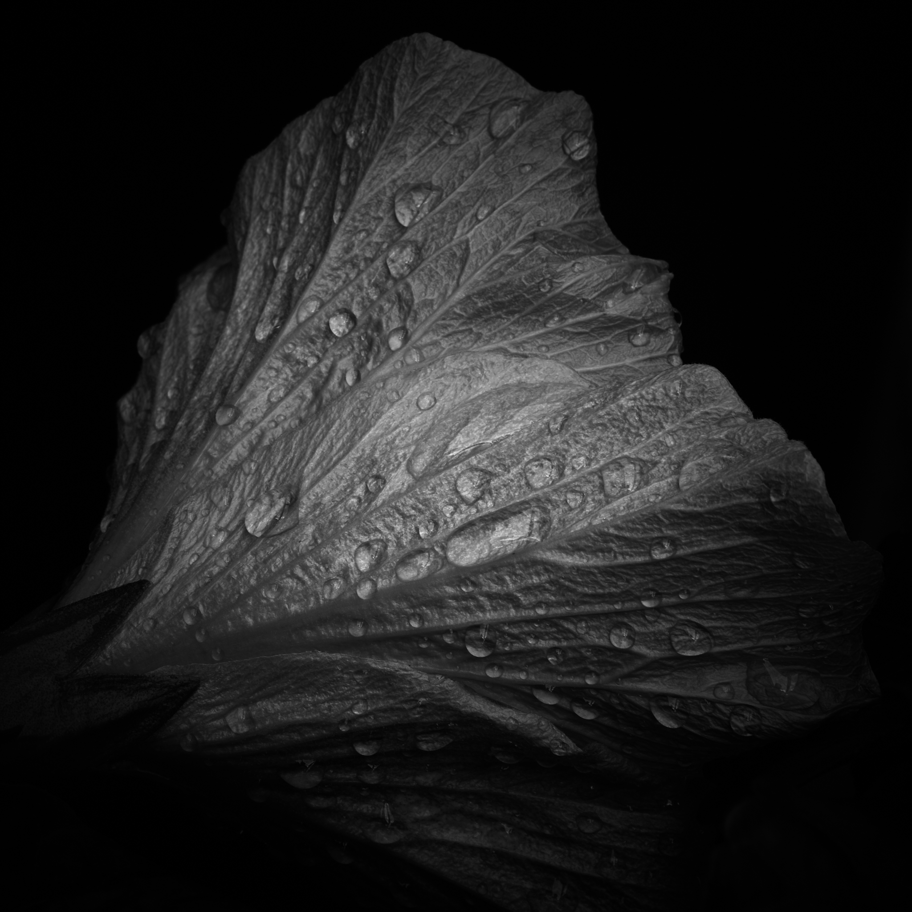

Der Sommer hat Regenlöcher, durch die es tröpfelt oder auch mal wie aus 
Eimern schüttet. Die Reflexe, die es nach dem Regen überall gibt, 
liefern unzählige Motive. Und doch konnte ich mich bislang nicht 
aufraffen, mir die Kamera zu greifen und sie auf Fotos zu bannen.

Immerhin habe ich letztens eine Regenpause auf dem Balkon genutzt, um 
den Hibiskus, der nimmermüde jeden Tag neue Blüten hervorbringt, in 
seinem Eifer festzuhalten. Die Blüten sind flüchtig wie die Regentropfen 
... nach nur einem Tag haben sie genug geleuchtet und rollen sich 
mit sich selbst zufrieden für immer zusammen.

