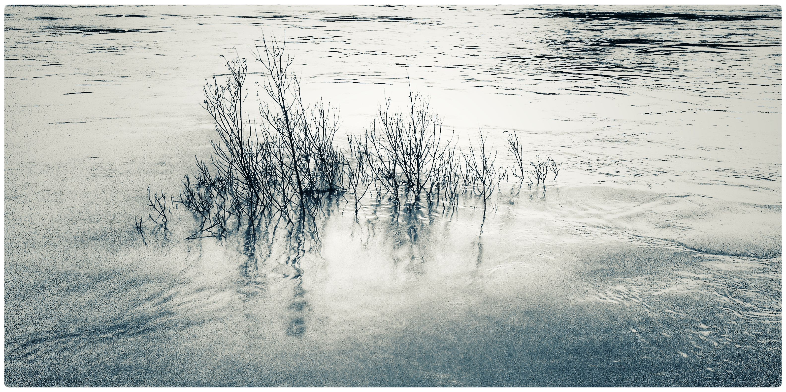

Der Rhein hatte Hochwasser. So hoch, dass in der Rheinaue sogar der Radweg 
unten am Ufer für ein paar Tage gesperrt war. Von diesem Strauch am Ufer in
Godesberg schaute nur noch die Spitze aus dem Wasser heraus.

