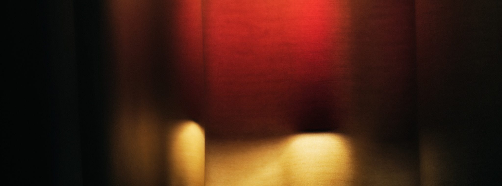

Aufgenommen schon Ende Oktober letzten Jahres habe ich es seitdem mehrfach 
bearbeitet. Erst in einer Versuchsreihe mit mehreren RAW-Entwicklern 
unter Linux. Ich wollte schauen, ob ich da den Umstieg weg von Windows 
und Capture One hinbekomme. Diese Bearbeitung ist bei einem 
zwischenzeitlichen Rückfall mit Capture One entstanden. Und es ist nach 
wie vor wunderbar unscharf.

