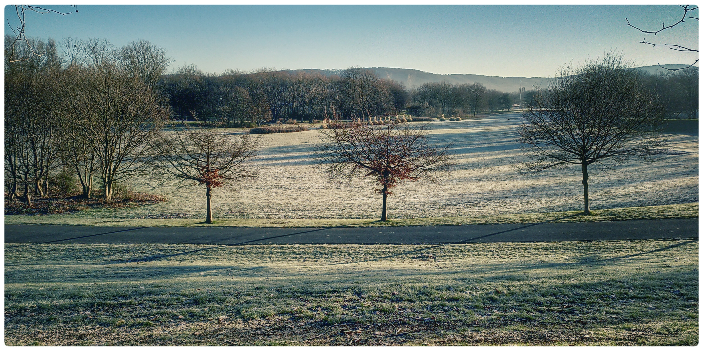

Anfang Februar gab es nicht nur graues und trübes Wetter, sondern auch 
ein paar Tage lang ein Gefühl von Winter. Nächte mit tiefem Frost, den 
unsere alte Gießkanne auf der Terrasse nicht überlebt hat. Und eine 
Morgensonne von einem strahlend blauen, kalten Himmel, die den Reif auf 
den Wiesen glitzern ließ wie unzählige Glassplitter.

