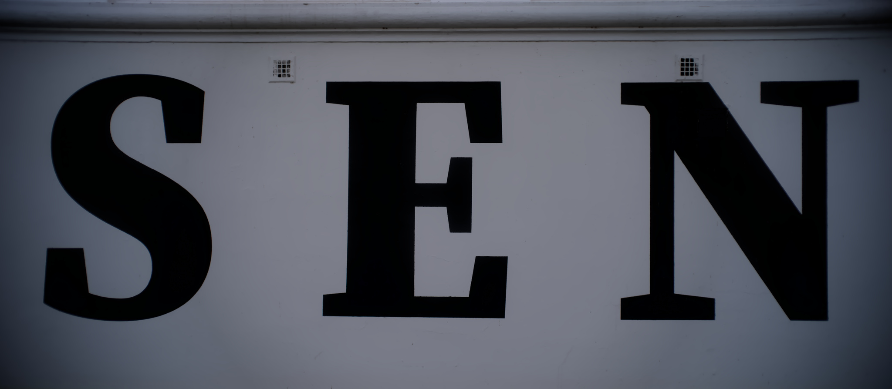

Die erste Version hatte ich bei miesem Licht kurz vor einem Regenschauer 
mit dem Handy geschossen. Sah dann zu Hause ganz nett aus. Also noch mal 
in den Tagen darauf mit der Kamera hin ... um festzustellen, dass die 
Buchstaben zum Teil zu breit sind oder sich die beiden Zeilen in die 
Quere kommen. Zumal ich ja auch noch Platz lassen musste, um die 
Perspektive in der Bearbeitung wieder gerade zu rücken. Mit den dreien 
hat's dann aber geklappt.

Achso, wo das ist? Am Rhein, die Fassade vom alten Dreesen in Godesberg.

