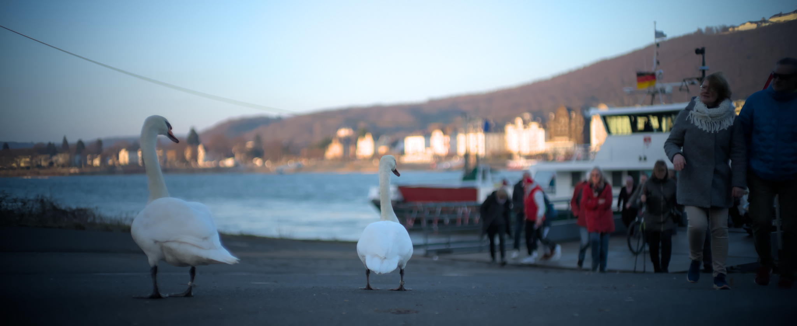

Eigentlich ist dies das erste Foto dieses Projektes. Zumindest hat es mich 
dazu bewogen, mein Foto-Projekt wirklich zu starten. Bis dahin waren es 
nur eine Idee und ein paar Sätze hier im Web.

Heute war Rosenmontag. Als Immi ist mir das Brauchtum auch nach zwanzig 
Jahren nicht nahe genug gekommen, um mir Farbe ins Gesicht zu packen und 
mich mit Massen von Menschen an die Straße zu stellen. Aber ich gönne 
den Anderen ihren Spaß und genieße in jedem Jahr den freien Montag. Nach 
einem trüben Wochenende lockte heute die Sonne zu einer abendlichen Runde 
mit dem Rad. An der zweiten Fähre belagerten diese beiden entspannten Gesellen 
den Radweg und die Straße.

Sie waren noch unschlüssig, ob sie mir nur die Ventile aus den Reifen 
drehen sollten. Oder doch lieber mit dem alten Lanz, der gerade blubbernd 
vom Umzug angekommen war, als blinde Passagiere auf die andere Rheinseite 
übersetzen? Zwei rheinische Vögel!
