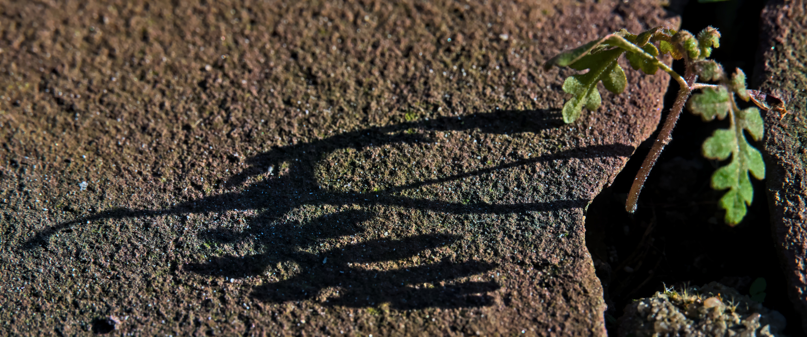

Meteorologisch ist der Winter schon vorbei. Vielleicht hat sich das 
Pflänzchen genau deshalb eine Spalte auf unserer Terrasse gesucht, 
aus der es seine Blätter in das wärmende Mittagslicht strecken kann? 
Die tiefstehende Sonne lässt es zum Abend hin dann noch einmal mit 
seinem Schatten wachsen, bevor es in der Nacht wieder frostig wird.   

