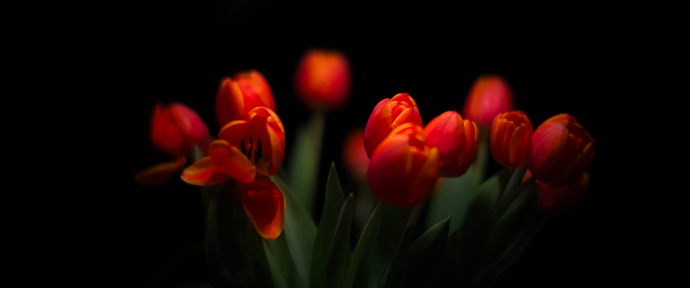

Normalerweise versorgen wir uns in den kalten Monaten beim Supermarkt 
unseres Vertrauens direkt gegenüber mit Blumen. So hangeln wir uns von
Woche zu Woche, bis es an den Ständen in der Stadt wieder Blumen aus der
Region gibt.

Diesmal begleitete uns aber ein Tulpenstrauß vom Holländer in der Stadt
durch die Woche. Bestimmt auch aus dem Gewächshaus, aber in einer ganz 
anderen Qualität. Die fallenden Blütenblätter und dick mit schwarzem 
Blütenstaub besetzten Stempel hätten Material für eine eigene Session
geliefert. Da kam mir aber der Ordnungssinn in die Quere, der sie direkt
in den Kompost entsorgt hat. Immerhin habe ich zwei abendliche Bilder
für diese Woche übrig behalten.

